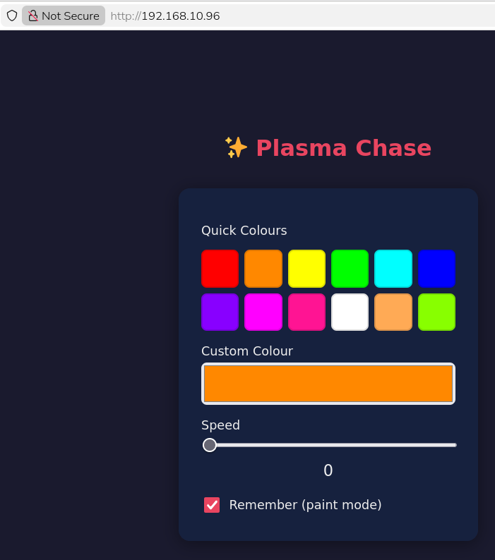

# ✨ Plasma Chase

A WiFi-controlled LED chase animation for the **Pimoroni Plasma 2350W** board
with a WS2812 (NeoPixel) LED strip.

A single bright LED chases around the strip with a smooth fading trail.
You control the colour, speed, and a fun "paint mode" — all from your phone
or any web browser on the same network, or with the onboard button.

---

## Hardware

| Component | Details |
|-----------|---------|
| Board | [Pimoroni Plasma 2350W](https://shop.pimoroni.com/products/plasma-2350-w) (RP2350 + CYW43 WiFi) |
| LED strip | WS2812 / NeoPixel compatible, up to 60 LEDs (configurable) |
| Data pin | GPIO 15 (active by default on the Plasma 2350W) |
| Button A | GPIO 12 (active-low, directly on the board) |
| Onboard LED | RGB LED on GPIOs 16, 17, 18 (active-low, PWM driven) |

## Files

| File | Purpose |
|------|---------|
| `chase_web.py` | Main program — upload to the board |
| `secrets.py` | Your WiFi credentials (keep private!) |
| `main_chase.py` | Optional auto-run wrapper — upload as `main.py` on the board |
| `color_test.py` | Diagnostic tool for checking LED colour order |

## Quick Start

### 1. Create `secrets.py`

Create a file called `secrets.py` alongside `chase_web.py` with your WiFi
credentials:

```python
WIFI_SSID = "YourNetworkName"
WIFI_PASSWORD = "YourPassword"
```

> ⚠️ This file is git-ignored and should never be committed.

### 2. Upload to the board

Using [Thonny](https://thonny.org/) or another MicroPython IDE, upload these
files to the root of the Plasma 2350W filesystem:

- `chase_web.py`
- `secrets.py`

### 3. Run it

In Thonny, open `chase_web.py` and press **Run**. Watch the console for your
board's IP address:

```
Booting…
Connecting to YourNetworkName…
  waiting… (status=1)
  waiting… (status=1)
Connected!  →  http://192.168.1.42
[WEB] Listening on :80
```

### 4. Open the control page

Navigate to the IP shown in the console (e.g. `http://192.168.1.42`) from
any device on the same WiFi network.

---

## Auto-start on Power-on

To make the animation start automatically when the board powers up, upload
`main_chase.py` to the board as **`main.py`** (MicroPython runs `main.py`
automatically after `boot.py`).

The contents are simply:

```python
import chase_web
```

---

## Web Interface

The web UI is a single dark-themed responsive page that works on mobile and
desktop. No internet connection required — everything is served directly from
the board.



### Controls

| Control | Description |
|---------|-------------|
| **Quick Colours** | 12 colour swatches — tap to apply instantly |
| **Custom Colour** | Full colour picker for any RGB colour |
| **Speed slider** | 0 (paused) → 100 (fastest). Drag to adjust |
| **Remember** | Toggle paint mode on/off (see below) |

---

## Paint Mode

When **Remember** (paint mode) is enabled, each LED keeps the colour the
chaser painted onto it. This lets you "draw" multi-coloured patterns around
the strip:

1. Enable **Remember** (web checkbox or long-press Button A).
2. Pick a colour and let the chaser paint LEDs.
3. Change colour — new LEDs get the new colour; old ones keep theirs.
4. Disable **Remember** to clear the canvas and return to normal chase mode.

Painted LEDs are shown at 40% brightness so the chaser head is still clearly
visible.

---

## Button A Controls

The physical **Button A** on the Plasma 2350W provides three gestures:

| Gesture | Action |
|---------|--------|
| **Short press** | Cycle to the next colour in the preset sequence |
| **Double press** | Toggle pause / resume (speed 0 ↔ 25) |
| **Long press** (≥ 600 ms) | Toggle paint mode on / off |

---

## Onboard LED Behaviour

The tiny RGB LED on the board itself acts as a status indicator:

| Phase | LED Colour |
|-------|-----------|
| **Boot** | Solid green |
| **Connecting to WiFi** | Blinking red |
| **WiFi connected** | Solid green (2 seconds) |
| **Running** | Mimics the current chase colour (dimmed to ~15%) |
| **Web request** | Rapid white flicker (~800 ms per request) |
| **Shutdown** | Off |

---

## Configuration

All tuneable values are constants near the top of `chase_web.py`:

| Constant | Default | Description |
|----------|---------|-------------|
| `NUM_LEDS` | 60 | Number of LEDs on your strip |
| `TRAIL_LENGTH` | 4 | Number of fading trail LEDs behind the head |
| `DEFAULT_SPEED` | 25 | Initial speed (0–100) |
| `ONBOARD_DIM` | 0.15 | Onboard LED brightness (0–1) |
| `PAINT_DIM` | 0.4 | Brightness of painted LEDs (0–1) |
| `TRAFFIC_MS` | 800 | Onboard flicker duration per web request (ms) |
| `LONG_PRESS_MS` | 600 | Button hold time for long-press (ms) |
| `DOUBLE_PRESS_MS` | 300 | Window for detecting a double-press (ms) |
| `SWATCHES` | 12 colours | Hex codes shown in the web UI grid |
| `COLOR_SEQUENCE` | 10 colours | Colours cycled by Button A short-press |

---

## Troubleshooting

### WiFi won't connect
- Double-check SSID and password in `secrets.py`.
- The CYW43 chip only supports **2.4 GHz** networks.
- If it times out, it will raise a `RuntimeError` — try power-cycling.

### LEDs show wrong colours
- Run `color_test.py` to identify the correct colour order.
- The default is `COLOR_ORDER_BGR` which works for most NeoPixel-compatible
  flexible wire strips.

### Web page doesn't load
- Make sure your phone/computer is on the **same WiFi network**.
- Try the IP address directly (not a hostname).
- The board runs a single-connection server — if it seems stuck, wait a
  moment and reload.

### Script won't auto-start
- The file on the board must be named exactly `main.py` (not `main_chase.py`).
- Make sure both `chase_web.py` and `secrets.py` are also on the board.
